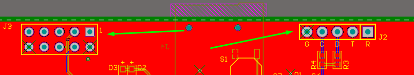
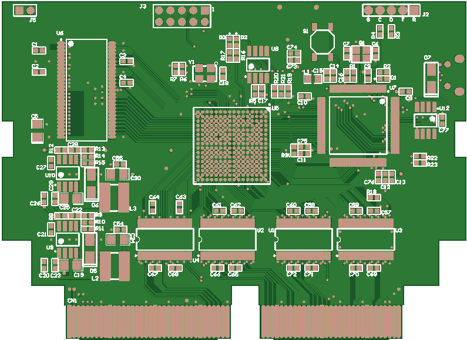

### SAROO is a HDLoader for SEGA Saturn.

SAROO是一个土星光驱模拟器。SAROO插在卡槽上，实现原主板的CDBLOCK的功能，从SD卡装载游戏并运行。
SAROO同时还提供1MB/4MB加速卡功能。

SAROO es un emulador de unidad óptica de Saturno. SAROO se inserta en la ranura para tarjetas para realizar la función CDBLOCK de la placa base original, cargar juegos desde la tarjeta SD y ejecutarlos.
SAROO también proporciona la función de tarjeta aceleradora de 1MB/4MB.

--------
Fotos del proyecto original

  
  

--------
### 开发历史

#### V1.0
最初的SAROO仅仅是在常见的usbdevcart上增加了一个usbhost接口。需要对游戏主程序进行破解，将对CDBLOCK的操作转化为对U盘的操作。
这种方式需要针对每一个游戏做修改，不具备通用性。性能与稳定性也有很大问题。只有很少的几个游戏通过这种方式跑起来了。
(V1.0相关的文件未包括在本项目中)

El SAROO original acaba de agregar una interfaz usbhost al usbdevcart común. Es necesario descifrar el programa principal del juego y convertir la operación de CDBLOCK en la operación del disco U.
Este método debe modificarse para cada juego y no es universal. También existen grandes problemas con el rendimiento y la estabilidad. Sólo unos pocos juegos se han lanzado de esta manera.
(Los archivos relacionados con V1.0 no están incluidos en este proyecto)

#### V1.1
新版本做了全新的设计。采用FPGA+MCU的方式。FPGA(EP4CE6)用来实现CDBLOCK的硬件接口，MCU(STM32F103)运行固件来处理各种CDBLOCK命令。
这个版本基本达到了预期的目的，也有游戏几乎能运行了。但也有一个致命的问题: 随机的数据错误。在播放片头动画时会出现各种马赛克，
并最终死掉。这个问题很难调试定位。这导致了本项目停滞了很长时间。

La nueva versión tiene un diseño completamente nuevo. Adopte el método FPGA+MCU. FPGA (EP4CE6) se utiliza para implementar la interfaz de hardware de CDBLOCK y MCU (STM32F103) ejecuta firmware para procesar varios comandos de CDBLOCK.
Esta versión básicamente logra el propósito previsto y algunos juegos casi pueden ejecutarse. Pero también hay un problema fatal: los errores aleatorios de datos. Aparecerán varios mosaicos al reproducir la animación del título.
y finalmente murió. Este problema es difícil de depurar y localizar. Esto provocó que el proyecto se paralizara durante mucho tiempo.

#### V1.2
1.2版本是1.1版本的bugfix与性能提升，使用了更高性能的MCU:STM32H750。它频率足够高(400MHz)，内部有足够大的SRAM，可以容纳完整的CDC缓存。
FPGA内部也经过重构，抛弃了qsys系统，使用自己实现的SDRAM与总线结构。这个版本不负众望，已经是接近完美的状态了。
同时，通过把FPGA与MCU固件逆移植到V1.1硬件之上，V1.1也基本达到了V1.2的性能了。

La versión 1.2 es una corrección de errores y una mejora del rendimiento de la versión 1.1, utilizando una MCU de mayor rendimiento: STM32H750. Tiene una frecuencia lo suficientemente alta (400 MHz) y tiene suficiente SRAM en su interior para acomodar un caché CDC completo.
La FPGA también ha sido reestructurada internamente, abandonando el sistema qsys y utilizando su propia SDRAM y estructura de bus. Esta versión está a la altura de las expectativas y ya se encuentra en condiciones casi perfectas.
Al mismo tiempo, al trasladar el firmware FPGA y MCU al hardware V1.1, la V1.1 básicamente alcanzó el rendimiento de la V1.2.

--------
### 当前状态

测试的几十个游戏可以完美运行。  
1MB/4MB加速卡功能可以正常使用。  
SD卡支持FAT32/ExFAT文件系统。  
支持cue/bin格式的镜像文件。单bin或多bin。  
部分游戏会卡在加载/片头动画界面。  
部分游戏会卡在进行游戏时。  

### Estado actual

Decenas de juegos probados funcionaron perfectamente.
La función de tarjeta aceleradora de 1 MB/4 MB se puede utilizar normalmente.
La tarjeta SD admite el sistema de archivos FAT32/ExFAT.
Admite archivos de imagen en formato cue/bin. Contenedor único o contenedores múltiples.
Algunos juegos se atascarán en la interfaz de carga/animación de títulos.
Algunos juegos se atascarán mientras se juega.

--------
### 硬件与固件

原理图与PCB使用AltiumDesign14制作。  
V1.1版本需要飞线才能正常工作。不应该再使用这个版本了。  
V1.2版本仍然需要额外的一个上拉电阻以使用FPGA的AS配置方式。  

FPGA使用Quartus14.0开发。  

Firm_Saturn使用SaturnOrbit自带的SH-ELF编译器编译。  
Firm_v11使用MDK4编译。  
Firm_V12使用MDK5编译。  

### Hardware y firmware

El diagrama esquemático y la PCB se producen con AltiumDesign14.
La versión V1.1 requiere cables voladores para funcionar correctamente. Esta versión ya no debería usarse.
La versión V1.2 todavía requiere una resistencia pull-up adicional para usar el modo de configuración AS de la FPGA.

FPGA se desarrolla utilizando Quartus14.0.

Firm_Saturn se compila utilizando el compilador SH-ELF que viene con SaturnOrbit.
Firm_v11 se compila utilizando MDK4.
Firm_V12 se compila utilizando MDK5.

--------
### SD卡文件放置

<pre>
/ramimage.bin      ;Programa de firmware de Saturno.
/SAROO/ISO/        ;Almacena imágenes de juegos. Un juego por directorio. El nombre del directorio se mostrará en el menú.
/SAROO/update/     ;Almacena firmware para actualizaciones.
                   ;  FPGA: SSMaster.rbf
                   ;  MCU : ssmaster.bin
</pre>

--------
Información extra fuera de proyecto:

Se puede hacer debug con un USB TTL para conocer el estado de carga, como monta la unidad.
Esta informacion puede ser utíl para mejorar el rendimiento de carga, saber si se ha montado bien la unidad SD y
obtener otros parametros de interés.

Simplemente en el usbserial conectamos RX en T.
Con putty u otro software de lectura serial  El bitrate es 1000000.

Recomendaciones o informacion de interes extraida:

--------

Para la creancion de 0 del proyecto:

Para cada firmware, pondré el último en la versión.

Firmware STM32: requiere JFlash incluido con la herramienta jlink

Firmware FPGA: Hay dos formas de programar el firmware FPGA por primera vez.
1: Utilice la herramienta de programación de Altera (ahora Intel). https://www.intel.com/content/www/us/en/software-kit/711920/intel-quartus-ii-subscription-edition-design-software-version-13-0sp1-for-windows.html
Puede descargar esta herramienta desde la página: Programador Intel® Quartus® II y SignalTap II
2: SPIFlash se puede escribir directamente. Puede quitar el chip para programarlo o puede usar una herramienta para sujetar el chip y programarlo en la placa. Este método requiere invertir los bits alto y bajo de cada byte del firmware.

--------

一些开发中的记录: [SAROO技术点滴](doc/SAROO技术点滴.txt)

